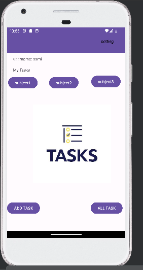
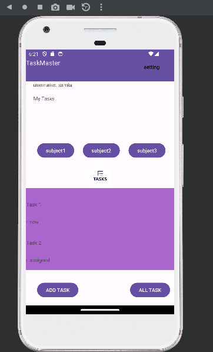
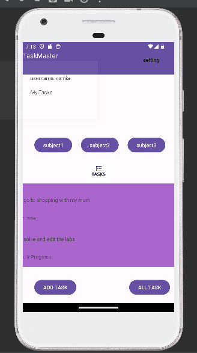
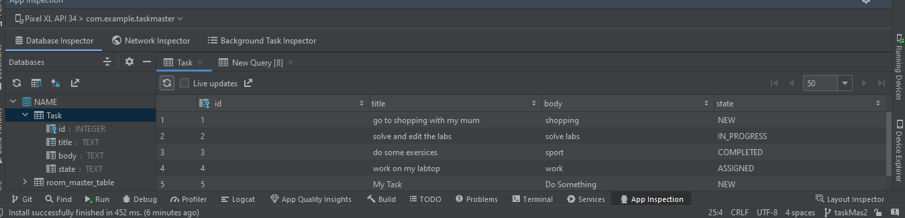
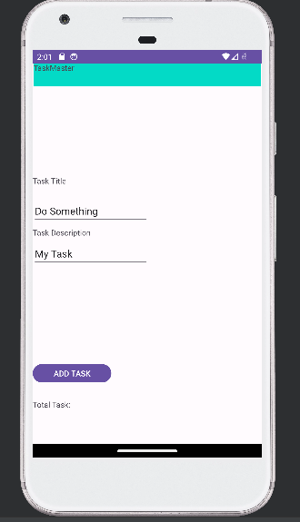
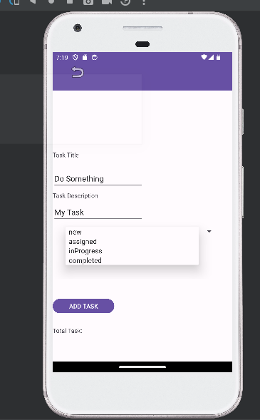
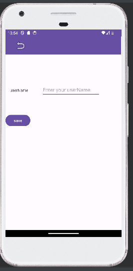
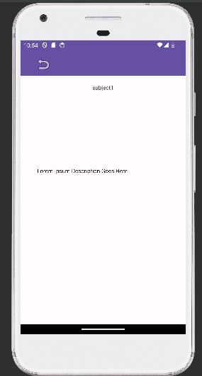

# taskmaster
Task Master is an Android application : 
That contain some features :
Add task 
Show all tasks 
show task details 
setting page that can save user name and shows it in the main page 
task details that shows the task name and discription 

-------------------------------------------------------------------
-------------------------------------------------------------------

# Main page :

 # main page with recycle view :

# main page with dataBase :

# database :

-----------------------------------------------------------------
# Addtask page :
allow users to type in details about a new task

 # Add task with spinner :

-------------------------------------------------------------------
alltasks page :

setting page :

task details :

