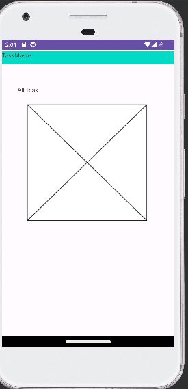

# taskmaster
Task Master is an Android application : 
That contain some features :
Add task 
Show all tasks 
show task details 
setting page that can save user name and shows it in the main page 
task details that shows the task name and discription 

## Activites :
Main activity :
it have some buttons (add task , all task , setting)
and it  show the tasks that added in the data base
# We update the main  task to read from aws dynamoDB 
ADD Tasks :
it will make the user add tasks and descriptions and the status of this task then it will save in the database
# We update the add task to add to aws dynamoDB (to save)
setting page :
it make the user save his name and the appear in the main page
task details:
when the user click on the task it appear new page that show the details of this task

## steps to use aws :
1.Configure Amplify:
amplify configure
2.Add API:
amplify add api 
3.Update API (Optional):
If you need to make changes to your API configuration, you can run:
amplify update api
4.Push Changes to AWS:
amplify push
5.Generate code artifacts based on your GraphQL
amplify codegen

# Espresso Testing :
Add three Espresso tests 
### ADDTASKTest

### MainActivitysettingTest

### taskdetailsTest

### MainActivitywithAWSTest

-------------------------------------------------------------------
-------------------------------------------------------------------

# Main page :

 # main page with recycle view :

# main page with dataBase :

# database :

-----------------------------------------------------------------
# Addtask page :

 # Add task with spinner :

-------------------------------------------------------------------
# alltasks page :

-------------------------------------------------------------------
# setting page :

------------------------------------------------------------------
# task details :

# task details with database :

----------------------------------------------

